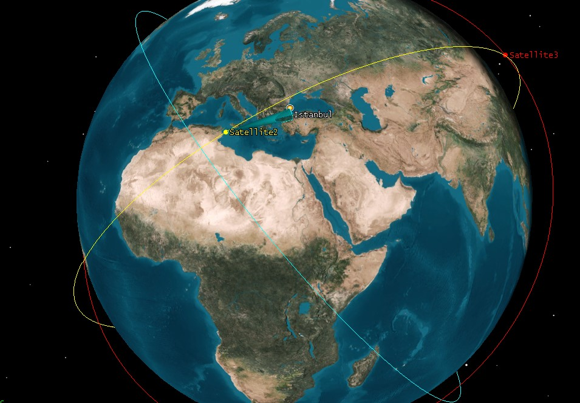
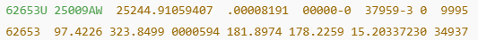
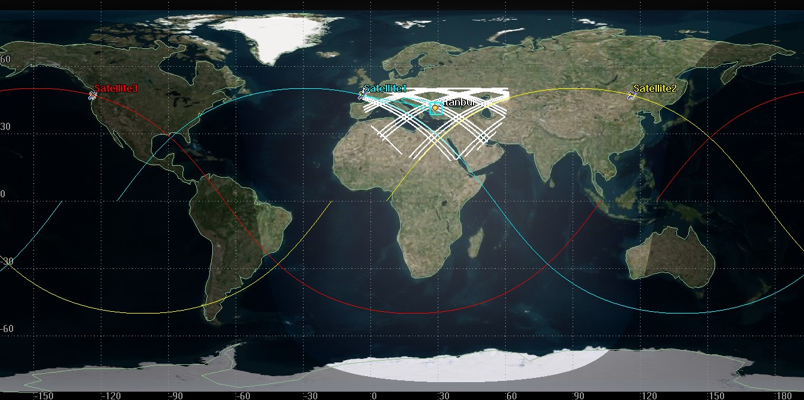
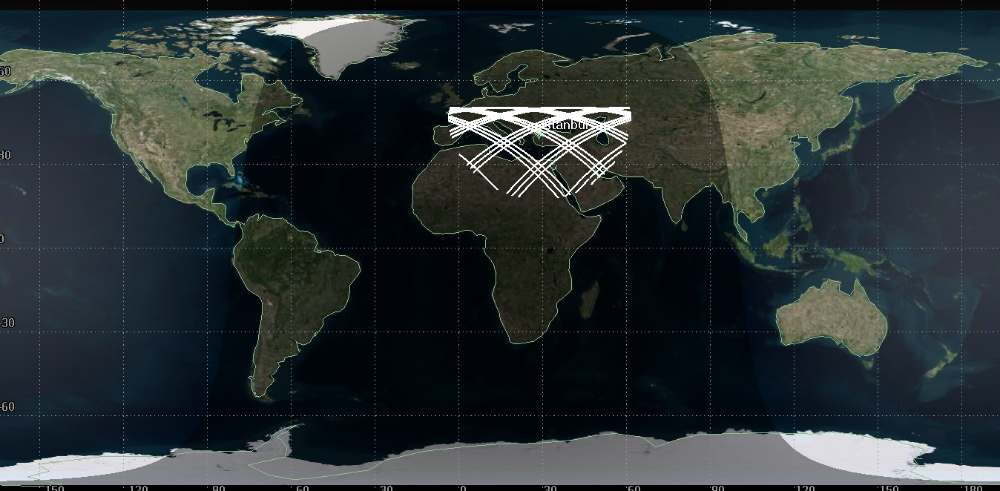

# ITU Space Systems Design & Test Laboratory: Internship

*Engineering internship (R&D) · Istanbul Technical University · 11 Aug – 5 Sep 2025*

## Context
A four-week compulsory internship at the ITU Space Systems Design & Test Laboratory (USTTL / SSDTL), Faculty of Aeronautics and Astronautics. The Aerospace Faculty building was being seismically retrofitted, so the clean rooms and environmental-test facilities (TVAC, vibration) could not be used. The work therefore focused on payload research and mission analysis in Ansys STK, with visits to the ground station and to a temporary clean room.

## Engineering questions
- Which thermal-infrared payload, cooled or uncooled, suits a wildfire-detection CubeSat that needs a ground sample distance (GSD) of about 200 m?
- How often can a small LEO constellation observe a given region (Istanbul), and how long do its passes last?
- How long would a CubeSat stay in orbit before drag-driven re-entry?

## What I performed
- **Payload trade study (cooled vs uncooled thermal IR).** I collected specifications for OroraTech's SAFIRE-Gen2 as the reference, and for two candidate designs: a cooled Leonardo Condor HD dual-band MWIR/LWIR detector and an uncooled SDC BIRD 640 VOx microbolometer. I then compared them on GSD, swath, sensitivity (NETD), power and mass.
- **GSD verification.** I used GSD = H·p/f to check the published figures:
  - SAFIRE-Gen2 (H = 550 km, p = 17 µm, f = 50 mm): about 187 m/pixel, close to OroraTech's specified ~200 m/pixel.
  - The two candidate designs: about 188 m/pixel (cooled) and about 187 m/pixel (uncooled) at 550 km.
- **STK analyses (Ansys Systems Tool Kit, STK Pro):**
  - **Access.** I imported the PAUSAT-1 TLE (i = 97.42°, sun-synchronous, period about 94.7 min, consistent with STK) and computed access windows over Istanbul.
  - **Lifetime.** I ran the STK Orbit Lifetime Tool for SharjahSat-1 (ballistic coefficient about 155.57 kg/m², NRLMSISE-00 atmosphere). The predicted lifetime was about 1.2 years at 550 km, depending on solar activity.
  - **Constellation.** Over 48 hours (29–30 Aug 2025) I modelled three custom satellites at 550 km and 50° inclination, with RAAN spaced by 120°. Each carried a 5° half-angle conic sensor (about 48 km swath) pointed at Istanbul, and I generated STK access reports for each satellite.

## What I observed
- **PAUSAT-1 downlink at UHUZAM (ITU CSCRS ground station).** A live pass was seen as a spectral peak near 2.2 GHz on the spectrum analyser. The pass reached about 17° elevation, just below the decoding threshold, so telemetry could not be fully decoded.
- **RAFS clean-room integration.** Engineers were integrating and testing the OBC and ADCS modules of the RAFS 6U CubeSat (Rubidium Atomic Frequency Standard) in a temporary clean room.

## Results
- **Payload trade study:** both candidates meet the ~200 m/pixel requirement. The cooled system gives about twice the swath (433 km vs 214 km, two cameras with 10 % overlap) and higher sensitivity. The uncooled system is much more CubeSat-friendly: 10–20 W instead of 33–40 W, and no cryocooler.
- **Constellation access over Istanbul (48 h):**
  - Satellite 1: 8 passes, mean duration about 668 s.
  - Satellite 2: 7 passes, mean duration about 728 s.
  - Satellite 3: 7 passes, mean duration about 690 s.
  - Total: **22 passes, about 11 per day**, compared with about 5–6 per day for a single satellite.
- The simple estimate (N × single-satellite passes, about 18 per day) overestimates the real revisit rate because access opportunities overlap. STK is needed to capture the real geometry.
- Pass durations of 8–12 min from the analytical estimate match the STK access reports (about 700–800 s).

## Validation
Hand calculations were checked against STK:
- the orbital period from the TLE mean motion
- the pass-duration estimate against the access-report durations
- the GSD formula against the published SAFIRE-Gen2 value

## Figures

*PAUSAT-1 two-line element set imported into STK.*

*2D world map with three orbital planes over Istanbul.*

*2D access map showing dense white coverage lines over Istanbul.*

The header image is the STK 3D view of the constellation and sensor cones over Istanbul.

## Repository contents
| Path | Content | Opens with |
|---|---|---|
| `report/INTERNSHIP_REPORT.pdf` | Internship report (25 pages) | Any PDF reader |
| `figures/` | STK screenshots | Image viewer |

## How to reproduce
The STK scenario files are not included. The constellation scenario can be rebuilt in Ansys STK (Pro) with the settings listed above and in the report (Week 4). The workflow follows the Harding Labs "Calculating Satellite Visitation Frequency with STK (Pro Version)" guide.

---
Kaoutar Ammara · Aerospace Engineer · [GitHub](https://github.com/Kiwiiiieee) · [LinkedIn](https://linkedin.com/in/kaoutar-ammara)
